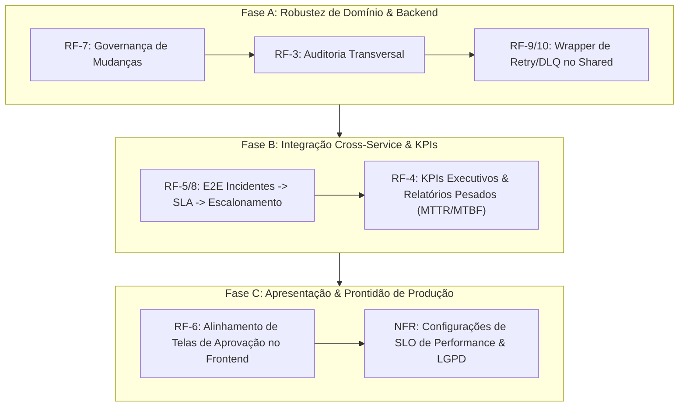

# Plano de Ação: Conclusão de Requisitos Parciais (PGIC)

Este documento descreve o plano detalhado e estruturado para levar os requisitos de estado **Parcial** para **Feito** na **Plataforma de Gestão de Incidentes Corporativos (PGIC)**.

---

## 🎯 Objetivos do Plano
1. **Consistência Ponta a Ponta:** Estabelecer fluxos funcionais completos conectando os microservices (Incidentes, SLA, Escalonamento, Requisições e Frontend).
2. **Resiliência e Padronização:** Garantir que todos os microservices consumam eventos e executem jobs pesados utilizando o mesmo padrão resiliente de retry/DLQ.
3. **Maturidade NFR (Requisitos Não-Funcionais):** Definir SLOs operacionais, compliance com LGPD e robustez nas políticas de rollback/failover.

---

## 🗺️ Mapa de Execução Faseado

---

## 📝 Detalhamento das Etapas e Tarefas

### Fase A: Robustez de Domínio & Backend (RF-7, RF-3, RF-9/10)

#### 1. RF-7: Governança de Mudanças (`problem-change-service`)
*   **Contexto:** O fluxo básico de mudanças existe, mas faltam travas determinísticas para janela de execução e edição por estado.
*   **Ações:**
    *   Implementar no domínio de mudanças a validação determinística da janela de execução (data de início menor que data de fim, e data de início futura em relação à criação da mudança).
    *   Impedir a edição de atributos sensíveis (janela de execução, impacto, riscos) de mudanças após serem aprovadas (`Approved`) ou estarem em execução (`Implementing`).
    *   Reforçar as permissões por RBAC impedindo que usuários comuns iniciem transições críticas como aprovações.
*   **Testes:** Adicionar testes na suíte de testes de mudanças validando as rejeições de edição inválidas.

#### 2. RF-3: Auditoria Transversal
*   **Contexto:** Versionamento foi implementado localmente em problemas/mudanças, mas as ações críticas nos serviços de incidentes e requisições precisam publicar trilhas de auditoria globais no `audit-service`.
*   **Ações:**
    *   Mapear transições críticas em `incident-service` (criação, atribuição, escalonamento, encerramento) para disparar eventos de auditoria.
    *   Mapear transições em `request-service` (criação, aprovações, reprovações, cancelamentos) para auditoria.
    *   Garantir a persistência desses eventos de auditoria de forma assíncrona no banco do `audit-service`.

#### 3. RF-9 / RF-10: Padronização de Retry/DLQ Cross-Service
*   **Contexto:** O `integration-service` tem o comportamento completo de retry e DLQ, mas outros consumidores de eventos RabbitMQ não o utilizam de maneira uniforme.
*   **Ações:**
    *   Desenvolver no pacote `@pgic/shared` um helper/decorator comum de mensageria que implementa:
        *   Classificação automática de erros (Erros Transitórios vs. Erros Terminais).
        *   Log uniforme com `correlationId`, `eventName`, `attempt` e `errorMessage`.
        *   Envio automático para DLQ ao estourar `maxAttempts` ou encontrar um erro terminal.
    *   Refatorar os consumidores do `incident-service`, `sla-service`, `escalation-service` e `notification-service` para utilizar esse helper.

---

### Fase B: Integração Cross-Service & KPIs (RF-5/8, RF-4)

#### 4. RF-5 / RF-8: E2E Incidentes ↔ SLA ↔ Escalonamento
*   **Contexto:** Testes isolados foram validados no `escalation-service`, mas é fundamental garantir o fluxo integrado E2E assíncrono.
*   **Ações:**
    *   Criar um cenário de teste integrado E2E que execute a sequência:
        1. Criação de um incidente de alta criticidade.
        2. O `sla-service` cria os prazos de SLA vinculados ao incidente.
        3. Simulação de estouro de prazo (breach) gerando o evento `sla.breach` com `breachType=response`.
        4. O `escalation-service` consome o evento e aplica a regra `no_first_response_minutes`, escalonando o incidente e registrando no histórico.
*   **Validação:** Executar o teste E2E garantindo que todas as mensagens trafeguem pelo RabbitMQ local e atualizem corretamente o estado dos registros no banco.

#### 5. RF-4: KPIs Executivos & Relatórios Pesados (MTTR/MTBF)
*   **Contexto:** Existe relatório básico, mas a geração assíncrona e cálculo de métricas executivas complexas (Tempo Médio de Reparo - MTTR e Tempo Médio Entre Falhas - MTBF) ainda são parciais.
*   **Ações:**
    *   Implementar use case no `reporting-service` que calcula o MTTR e MTBF agrupado por serviço, equipe ou criticidade.
    *   Integrar esse cálculo à exportação assíncrona: o usuário submete um pedido de relatório de KPIs executivos, um job é gerado e processado em segundo plano, e o download do arquivo CSV/PDF é disponibilizado via endpoint `/api/reports/jobs/:id/download`.
*   **Testes:** Cobertura de testes unitários para a fórmula matemática de MTTR/MTBF considerando cenários de incidentes sem data de conclusão ou sem interrupções.

---

### Fase C: Apresentação & Prontidão de Produção (RF-6, NFRs)

#### 6. RF-6: Alinhamento de Telas de Aprovação no Frontend
*   **Contexto:** O backend de aprovações avançadas (sequencial e paralelo) está pronto, mas o frontend precisa exibir esses estados.
*   **Ações:**
    *   Desenvolver/ajustar telas de gerenciamento de requisições na UI para refletir o `approvalState` (exibindo se a requisição está em aprovação sequencial indicando o step atual, ou em aprovação paralela indicando quais papéis já aprovaram).
    *   Habilitar botões de aprovação dinâmicos que só aparecem se o usuário logado possui a permissão/papel necessário para o step atual de aprovação.

#### 7. NFRs de Produção: SLO de Performance, LGPD e Resiliência
*   **Ações:**
    *   **Performance (RF-3.2):** Adicionar no dashboard de Grafana e no Prometheus alertas explícitos baseados em SLO (ex: disparar alerta se a taxa de requisições HTTP 5xx passar de 1% ou latência p95 passar de 300ms por 5 minutos).
    *   **Segurança / LGPD (RF-3.1):** Consolidar a documentação jurídica sobre as políticas de retenção de dados e o script de expurgo diário (`prune-identity-data.ts`).
    *   **Disponibilidade (RF-3.4):** Executar um ensaio prático (Game Day) do runbook de rollback e registrar a linha do tempo e os resultados obtidos.

---

## 📈 Indicadores de Sucesso para Fechamento
- **Testes Unitários e de Integração:** Cobertura mínima de 85% nos novos use cases.
- **CI/CD:** Pipeline de builds e auditoria de segurança (`pnpm audit`, secret detection) verdes.
- **Rastreabilidade de Requisitos:** `docs/STATUS_FINAL_REQUISITOS.md` com evidência empírica para cada item.
